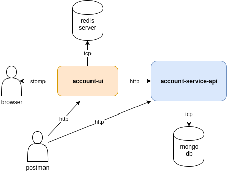

# account-demo

Solution diagram details. Deployment and User guides. 

* Account-UI [(github)](http://github.com/hugo-costa-tek/account-ui)
    - Front-end service communicates with browsers through STOMP messages
    - Exposes a REST endpoint to receive new accounts, saving data in redis server
    - Working as back-end service, the redis listener handles messages from redis server, calling account-service-api to persist accounts in MongoDB and refreshing browser clients in real-time through WebSockets
    
* Account-Service-API [(github)](http://github.com/hugo-costa-tek/account-service-api)
    - Exposes endpoints to create new accounts, find a specific account and list all accounts in database
    - All data are saved in MongoDB
    
## Deployment Guide

There are two ways to deploy demo application:

1) From Docker Hub:

    1) Download docker compose: docker-compose-dockerhub.yml
    
    2) Run command: docker-compose -f docker-compose-dockerhub.yml up -d

2) Locally:
 
    1) Clone git repositories:
        
        a) Account Service API: git clone git@github.com:hugo-costa-tek/account-service-api.git
        
        b) Account UI: git clone git@github.com:hugo-costa-tek/account-ui.git
    
    2) Build each project:
        
        a) cd account-service-api; mvn clean package -DskipTests; mvn docker:build; cd ..
        
        b) cd account-ui; mvn clean package -DskipTests; mvn docker:build; cd ..
        
    3) Run command: docker-compose -f docker-compose-local.yml up -d

At this time, both account-ui and account-service-api micro-services will be running.

## User Guide

1) Opening browser, accessing to http://localhost:8081

2) Click on "Connect" button to open WebSocket connection
 
3) Import "account-demo-collection.json" in Postman client

4) Submit the HTTP request:

    a) Account UI - Create Account: create account through front-end
    
    b) Account Service API - Get Account: get account data from back-end API service
    
    c) Account Service API - Get All Accounts: get accounts list from back-end API service
    
    d) Account Service API - Create Account: create account through back-end API service (browser will not be refreshed)
     